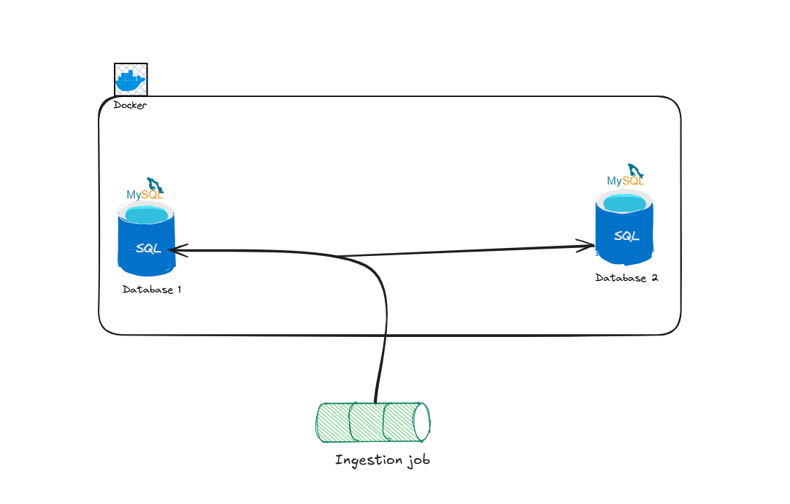

# Projet-ETL-avec-Docker-MySQL

A Python-based ETL (Extract, Transform, Load) project that demonstrates data manipulation and transfer between MySQL databases using Docker containers.





## Prerequisites
- Python 3.12+
- Docker & Docker Compose
- Git

## Installation
1. Clone the repository
```bash
git clone https://github.com/yourusername/Projet-ETL-avec-Docker-MySQL.git
cd Projet-ETL-avec-Docker-MySQL
```

2. Create and activate virtual environment
```bash
python -m venv venv
.\venv\Scripts\activate  # Windows
```

3. Install dependencies
```bash
pip install -r requirements.txt
```

4. Start Docker containers
```bash
docker-compose up -d
```

## Development
### Setup Development Environment
```bash
pip install -r requirements-dev.txt
pre-commit install
```
